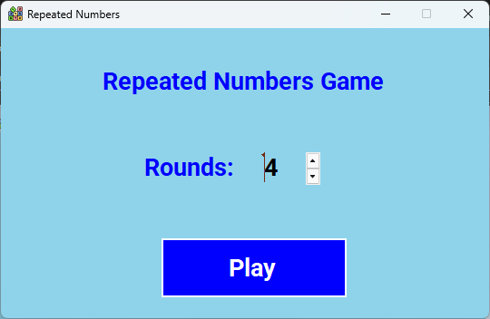
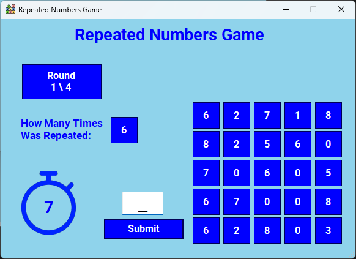
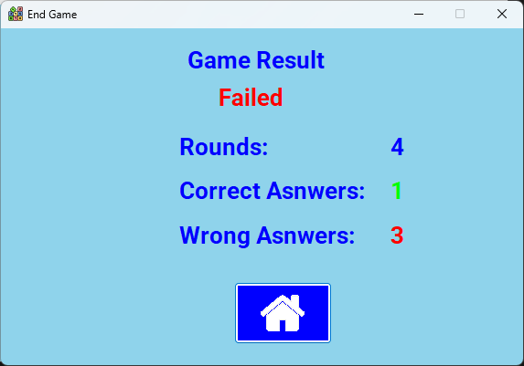

# Repeated Number Game 🎮

A simple game based on how fast you can guess how many times a number is repeated.

## ✨ Features

- Set the number of rounds
- Simple and clean UI
- Numbers range from 0 to 9
- Helps improve focus
- Each round is **10 seconds only**


## ⚙️ Technologies Used

- **C#**
- **WinForms**


## ▶️ How to Run

1. Clone the repository:

```bash
git clone https://github.com/AhmedAnwar-Dev/Repeated-Number--Game-.git
```

2. Open the project in **Visual Studio**
3. Press **Run** to start the game


## 🖼️ Screenshots

### 1️⃣ game Start


---
### 2️⃣game Play



---
### 3️⃣game End



## 🎓 What I Learned from This Project

- How to pass data between Forms
- How to group desired controls under a single List
- How to show an element at a specific time and hide it afterward
- How to add background sound
- How to separate Logic from UI
- How to use Random Numbers in C#
- How to iterate over all open Forms
- How to disable the Maximize or Minimize box
- How to set a custom color